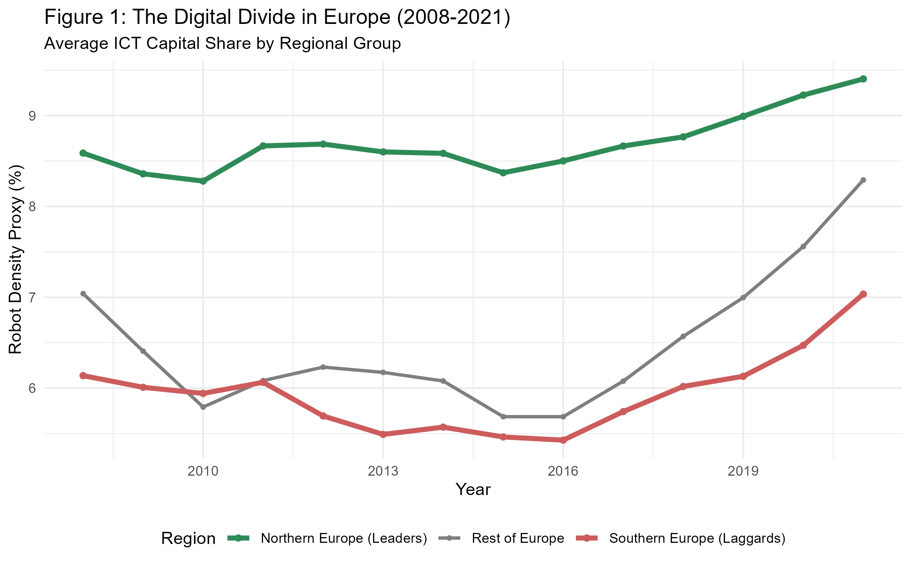
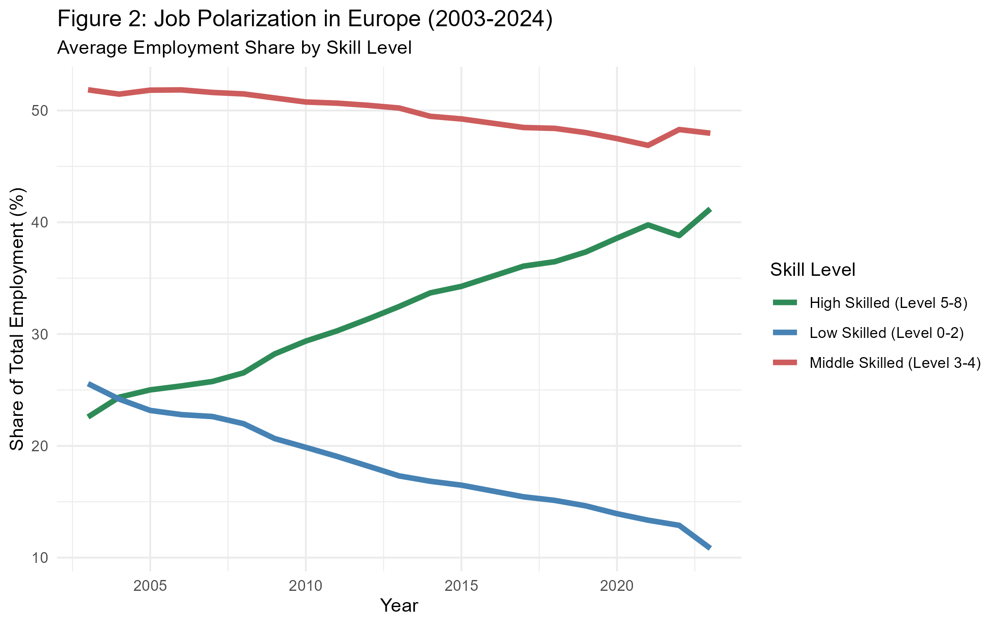
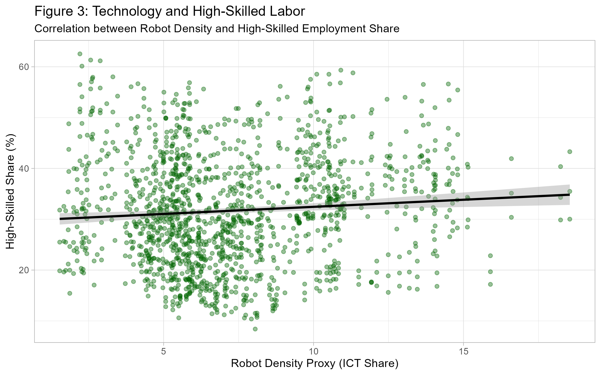
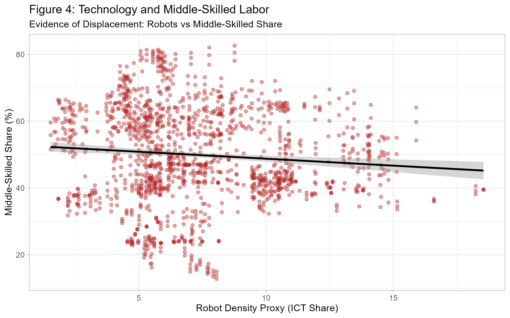
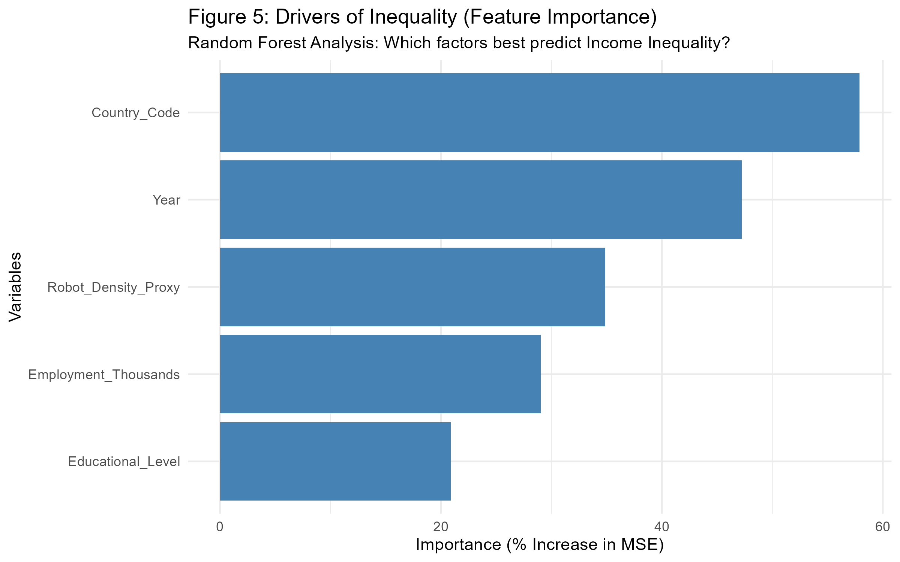
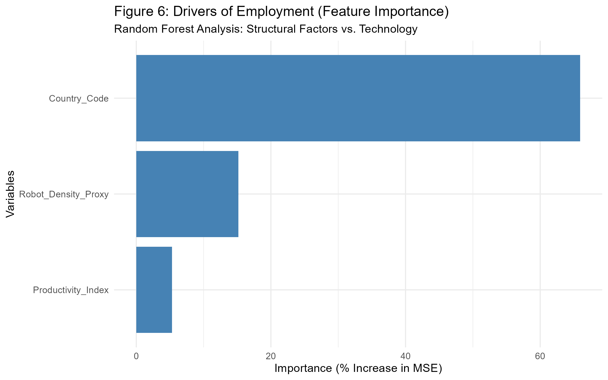
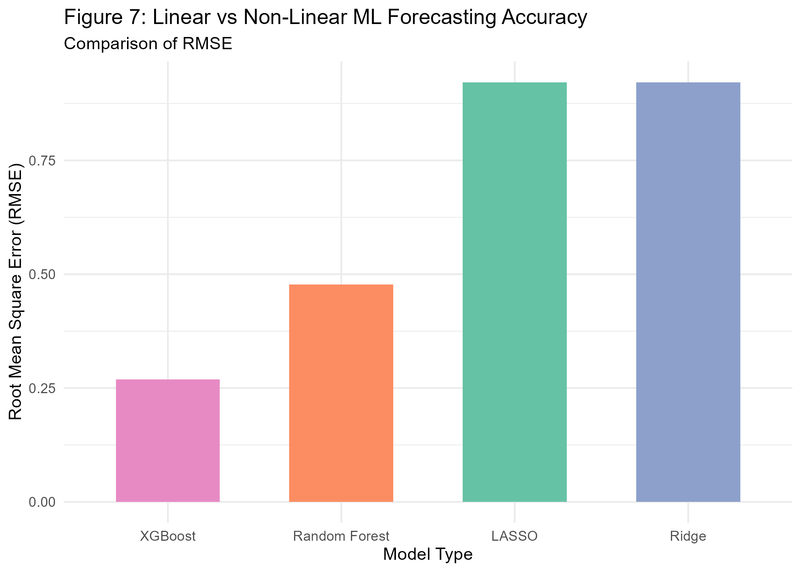

# Technology, Automation and Inequality: An Econometric and Machine Learning Forecasting Comparison

**Researcher:** Marina Kouloumbri  
**Department:** Economics, University of Cyprus  
**Supervisor:** Prof. Demitrios Xefteris  

---

## 🔬 Project Overview
This repository contains the data and code for my Bachelor's thesis, which examines the impact of **Robot Density** (ICT Capital Share) on **Income Inequality** and **Job Polarization** across Europe (2003–2024).

The study innovates by comparing traditional **Panel Fixed Effects Econometrics** with modern **Machine Learning** techniques (Random Forest, XGBoost, LASSO) to determine which better explains the non-linear shifts in the labor market.

## 📊 Key Results

### 1. The Digital Divide
There is a clear structural gap between Northern European "Tech Leaders" and Southern "Tech Laggards."

### 2. Job Polarization Evidence
We observe a "U-shaped" shift in employment: High-skilled and low-skilled shares are increasing, while middle-skilled roles are displaced by automation.

### 3. Correlation: Technology vs. Skills
Robot density shows a strong positive correlation with high-skilled labor demand and a negative correlation with middle-skilled labor.

### 4. Machine Learning Insights
Random Forest analysis identifies **Country-specific factors** and **Robot Density** as the primary drivers of income inequality.

### 5. Forecasting Performance
Non-linear ML models (XGBoost and Random Forest) significantly outperform linear models in forecasting inequality trends, as shown by the lower RMSE.

---

## 📂 Repository Structure
* `data/`: Contains the harmonized Education and Industry panels (from Eurostat/IFR).
* `scripts/`: R scripts for data cleaning, descriptive plots, and ML modeling.
* `figures/`: High-resolution outputs and visualizations.
* `Thesis.pdf`: Full text of the research.

## 🛠 How to Reproduce
1.  Clone this repository.
2.  Install the required R packages using `install.packages("pacman")`.
3.  Run `scripts/01_descriptive_analysis.R` to generate the descriptive figures.
4.  Run `scripts/02_ml_forecasting.R` to train the models and see the prediction results.
